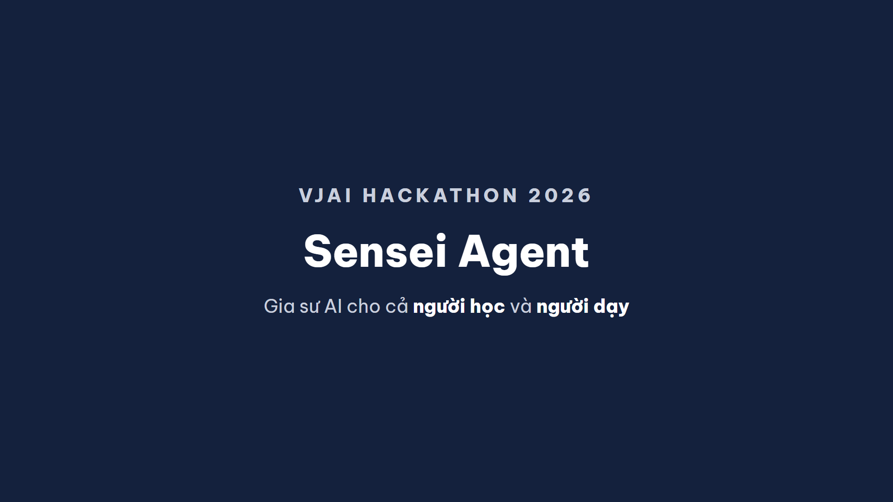
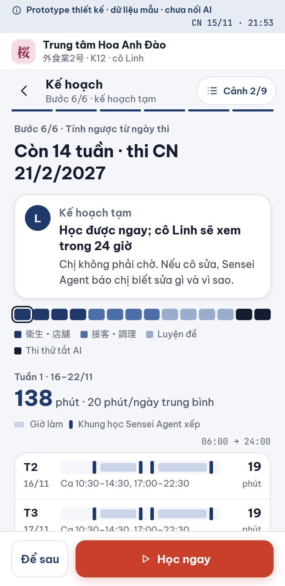
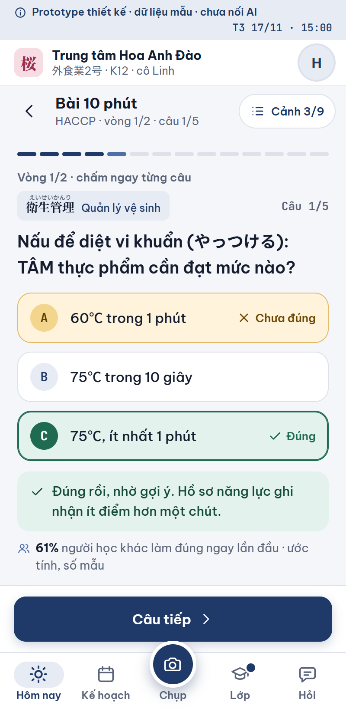
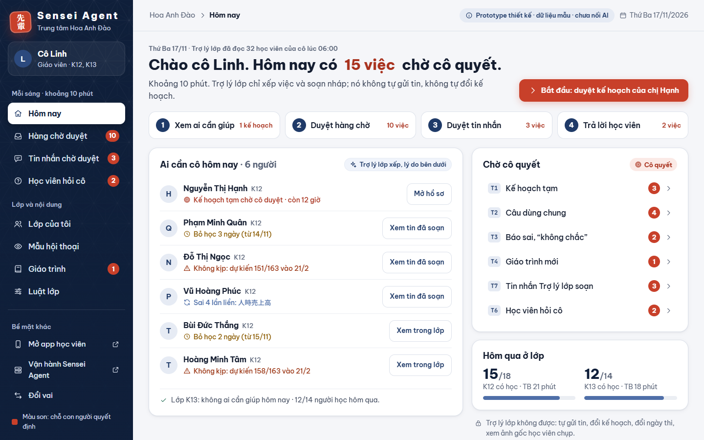
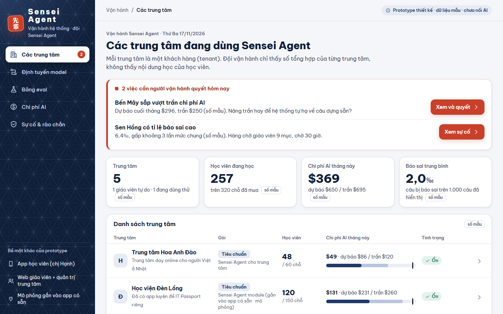

# Sensei Agent — gia sư AI cho cả người học và người dạy

> VJAI Hackathon 2026 · Team Tokyo Boys · Vòng Idea Proposal

| | |
|---|---|
| ▶ **Dùng thử demo (không cần cài đặt)** | **https://hoangduong92.github.io/sensei-agent/** |
| 🎬 **Video giới thiệu 55 giây** | [media/sensei-agent-video.mp4](media/sensei-agent-video.mp4) |
| 📄 **Proposal** | Nộp kèm qua Hackathon4U |

---

## Vấn đề

- **Người học** (người Việt đi làm ở Nhật) cần người kèm riêng mỗi ngày, sát công việc và người nghe thật của mình. App và chatbot thì dạy mọi người giống nhau và chỉ trả lời khi được hỏi.
- **Người dạy** (giáo viên, trung tâm, phòng nhân sự) không đủ giờ theo sát từng học viên. Vì vậy một giáo viên chỉ kèm được ít người, và học phí cao.

## Giải pháp: một agent, hai phía

| Người học có… | Người dạy có… |
|---|---|
| 15 phút đánh giá → lộ trình riêng | Bảng "hôm nay ai cần giúp" |
| Bài mỗi ngày: chọn bài, chấm, giải thích | Agent tự duyệt việc thường ngày (có nhật ký, thu hồi được) |
| Agent nhớ lỗi cũ, tự nhắc ôn đúng lúc | Hàng chờ ngoại lệ: chỉ việc cần người quyết |
| Lộ trình tự chỉnh 2 tuần/lần | Báo cáo tuần từng học viên |

**Đa tenant:** mỗi trung tâm, trường, doanh nghiệp là một tenant riêng, với dữ liệu, giáo trình và quy tắc lớp riêng. Tất cả dùng chung một lõi agent. Gói nội dung đầu tiên là **kính ngữ công sở**. Các gói tiếp theo dùng cùng lõi: kỹ năng đặc định, IT Passport, BJT.

## Xem demo theo 3 vai

| Vai | Link | Xem gì |
|---|---|---|
| Người học (điện thoại) | [demo/](https://hoangduong92.github.io/sensei-agent/demo/) | Đánh giá → lộ trình → bài hôm nay → giải thích. Nút "Hướng dẫn demo" dẫn qua từng cảnh. |
| Giáo viên / trung tâm | [demo/teacher/](https://hoangduong92.github.io/sensei-agent/demo/teacher/) | Việc hôm nay, hàng chờ ngoại lệ, hồ sơ học viên, tin nhắn |
| Vận hành đa tenant | [demo/ops/](https://hoangduong92.github.io/sensei-agent/demo/ops/) | Danh sách tenant, định tuyến model, đánh giá chất lượng, chi phí, sự cố |

## Vì sao là Agentic AI

Một chatbot chỉ chờ được hỏi. Sensei Agent **tự chủ động**: một bộ điều phối và 5 agent (Đánh giá · Lộ trình · Nhập vai · Sửa văn bản · Kiểm chứng). Mỗi ngày nó tự chọn bài, tự xếp lịch ôn, tự dự báo ai có nguy cơ không đạt, và tự quyết việc nào được duyệt luôn, việc nào chuyển cho giáo viên.

**Con người vẫn giữ quyền quyết:**
- Học viên quyết mục tiêu và dữ liệu được chia sẻ. Agent không bao giờ tự gửi email hay tin nhắn thay học viên.
- Giáo viên quyết tiêu chuẩn đánh giá, lộ trình đầu, và bật hay tắt từng loại việc mà agent được tự duyệt.

## AI có trách nhiệm

- Câu sửa kính ngữ phải bám hướng dẫn chính thức (文化審議会「敬語の指針」) và câu mẫu đã duyệt. Câu nào agent chưa chắc thì gắn nhãn "hỏi giáo viên".
- Dữ liệu cá nhân được che trước khi gửi tới mô hình AI. Mỗi tenant có dữ liệu tách riêng.
- Agent không tư vấn visa hay luật lao động mà chuyển người học tới kênh hỗ trợ chính thức.

## Kỹ thuật dự kiến cho MVP

Next.js PWA · FastAPI · PostgreSQL (tách dữ liệu tenant bằng RLS) · LangGraph · FSRS (lịch ôn) · Claude API · AWS Tokyo.

## Trạng thái hiện tại — nói thẳng

- Đây là **prototype thiết kế bấm được**: dữ liệu mẫu, **chưa nối AI thật**. Nó dùng để kiểm chứng luồng màn hình với người học và giáo viên trước khi xây MVP.
- Demo đang hiển thị gói **kỹ năng đặc định** (ngành thực phẩm). Gói kính ngữ trong proposal chạy trên cùng các màn hình và cùng lõi agent.
- Các con số mục tiêu trong proposal là mục tiêu của đội. Chúng sẽ được đo trong đợt pilot 20 học viên × 4 tuần.

## Chạy tại máy

Không cần cài gì. Mở `demo/index.html` bằng trình duyệt là chạy.

---
Prototype do đội phát triển, có dùng công cụ AI hỗ trợ theo Điều 12 Rulebook VJAI Hackathon 2026.
